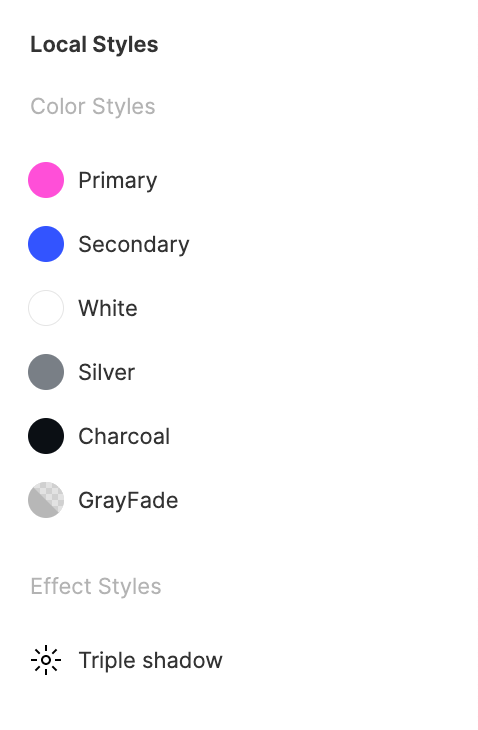
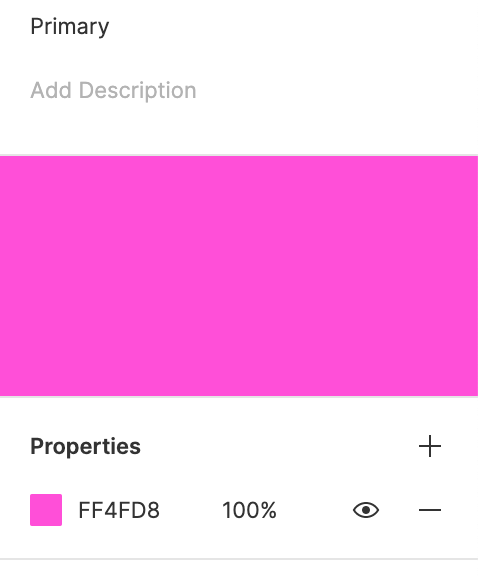

# Exercise 8: Design from Figma

The design for this application lives on Figma, a design tool (similar to Adobe Illustrator).

You can access the design here: https://www.figma.com/file/VAYO9Ezmxx4fMR29Sgylck/Spotify-App?node-id=0%3A1

Figma is a great tool for developers because it _gives you_ many of the details you would otherwise have to infer from a screenshot. For example, the side-panel gives you access to a set of "local styles":

When you mouse over a color, a little "Settings" icon appears on the right. Click that icon, and it will give you the hex color code for that color:

You can also click on individual elements to see their dimensions. If you hold `option` on Mac, `alt` on Windows, you'll be able to see the distances between adjacent elements. We can use this to determine our "margin":

Use the Figma design to style your artist profile. It should follow the design as closely as possible, and look something like this:

